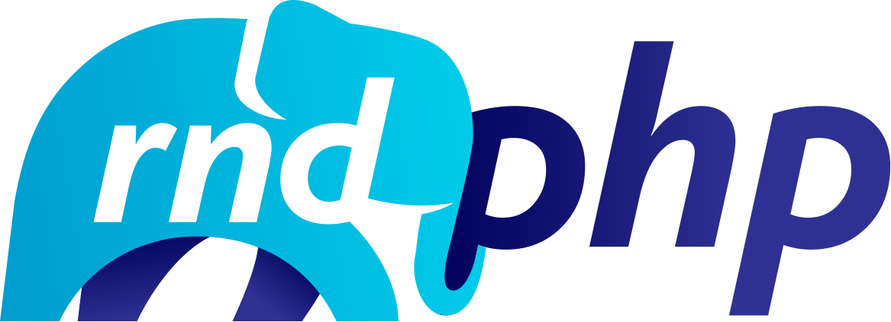

# Shower Presentation Template for RnD PHP

## Start
Install dependencies `npm install` and start it `npm start`.

Once you’re done you can build a clean copy of your slides:

    npm run prepare

And you’ll find your presentation in `prepared` folder with only needed files in it. You can also run `npm run archive` to get the same files in `archive.zip`. But there’s more! You can easily publish your presentation online by running:

    npm run publish

